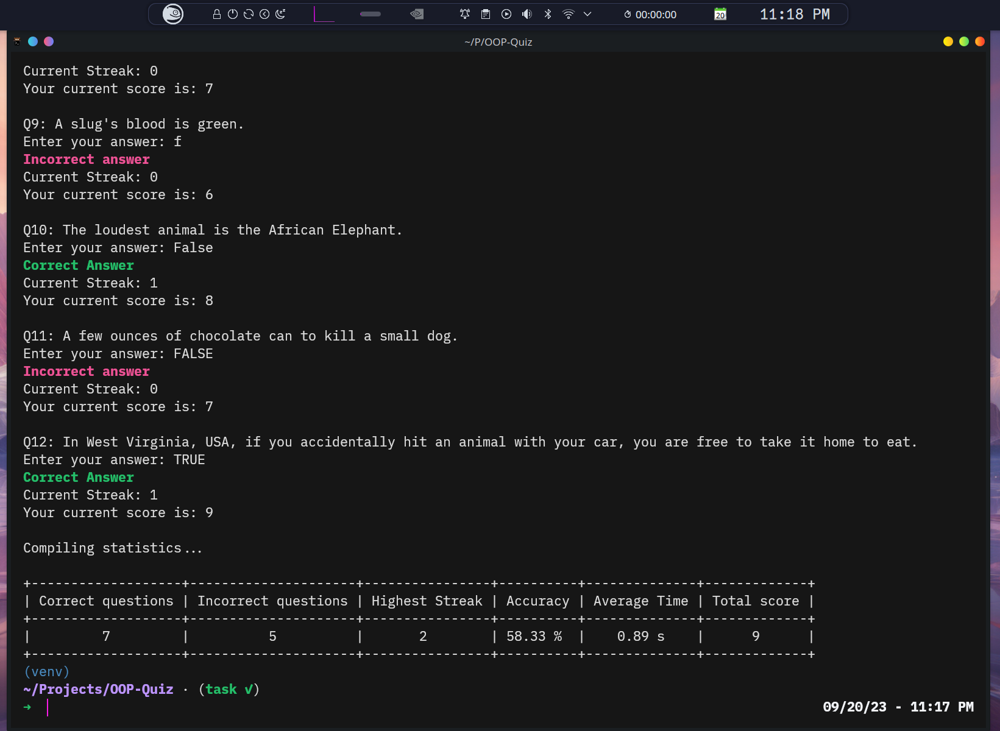
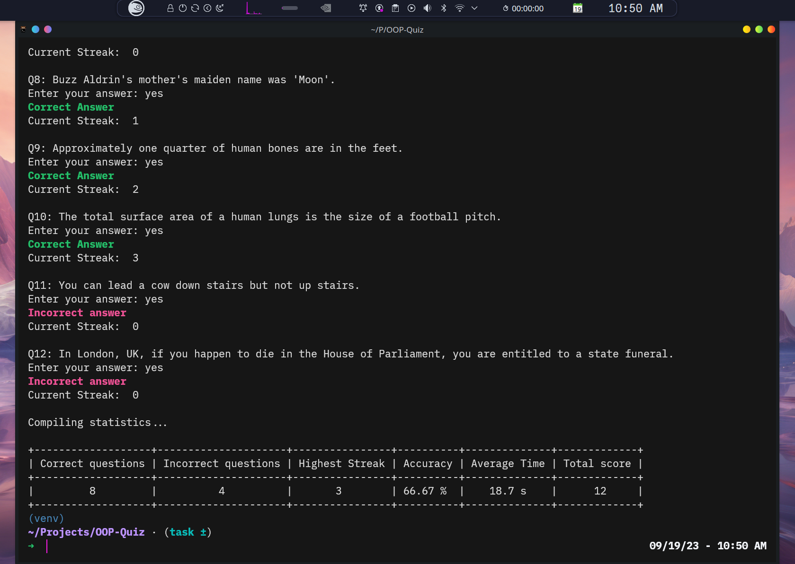

<div align="center">
<h1>OOP - Quiz v1.0</h1>

A command line application that simulates a trivia quiz, made using OOP principles
and written in Python

Current version : 1.0

Project done as a task for recruitments into the
GDSC's Backend - Web development division
</div>

---

# Usage

After cloning the repository, run the following command in a `venv` or on
your global python environment in the directory containing `requirements.txt`:

```zsh
pip3 install -r requirements.txt
```

to install all the necessary modules.

Then to start the quiz, simply use:

```zsh
python3 quiz.py
```

## Note

Ensure that you run this program in a terminal that supports
atleast 16bit / 16ANSI color, because the app uses the `termcolor` library

---

# Images

<details><summary><b>Images (Click to Expand)</b></summary>

Kitty on Linux x86-64



</details>

---

Project started on: 18/09/2023

(v1.0) First functional version completed on: 18/09/2023
